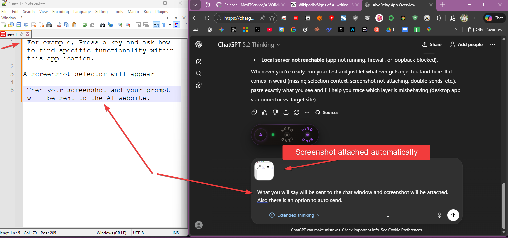

# AivoRelay


AI Voice Relay


> 🎙️ AI-powered voice-to-text with smart integrations for Windows  
> A fork of [cjpais/Handy](https://github.com/cjpais/Handy) with additional features

## ✨ Key Features

### 🤖 AI Replace Selection

Voice-controlled text editing — select text, speak instruction, get AI-transformed result.

- Select code → say "add error handling" → improved code replaces selection
- Select paragraph → say "make it shorter" → condensed version
- Empty field + "no selection" mode → say "write a greeting email" → generated text
- Works in any Windows application

**Setup:** Settings → Advanced → AI Replace Settings

### 📤 Send to ChatGPT/Claude

Voice-to-AI bridge via [AivoRelay Connector](https://github.com/MaxITService/AivoRelay-relay) browser extension.



| Mode                   | Input                  | What ChatGPT receives     |
| ---------------------- | ---------------------- | ------------------------- |
| **Voice only**         | Speak your question    | Your transcribed question |
| **Voice + Selection**  | Speak + selected text  | Question with context     |
| **Voice + Screenshot** | Speak + screen capture | Question with image       |

**Examples:**

- Say "what is recursion" → ChatGPT gets your question
- Select error log, say "why is this failing" → ChatGPT gets question + the log
- Capture chart, say "explain this" → ChatGPT gets question + screenshot

> ⚠️ **Requires:** [AivoRelay Connector](https://github.com/MaxITService/AivoRelay-relay) Chrome extension

### 🎚️ Transcription Profiles

Quick-switch between language, prompt, and LLM post-processing presets with dedicated shortcuts: swithc currently active profile or assign each profile its own hotkey!

#### What Are Profiles?

Profiles let you create different transcription configurations and switch between them instantly. Perfect for:

- **Multilingual users** — Switch between English, Russian, Finnish, etc.
- **Different use cases** — One profile for dictation, another for code comments
- **Translation workflows** — Speak in one language, output in another
- **Everything you can imagine!** — Serioulsy, you can invent so many uses!

#### Profile Settings

Each profile can customize:

| Setting | Description |
|---------|-------------|
| **Language** | Speech recognition language (e.g., English, Russian, Auto-detect) |
| **Translate to English** | Automatically translate non-English speech to English |
| **Push-to-Talk** | Hold hotkey to record vs. toggle on/off |
| **Voice Model Prompt** | System prompt for STT model (word hints, formatting) |
| **Include in Cycle** | Whether this profile appears when cycling through profiles |

#### LLM Post-Processing Override

Each profile can override the global LLM post-processing settings:

- **Enable/Disable** — Turn LLM processing on/off per profile
- **Custom Prompt** — Use a different prompt than the global one
- **Custom Model** — Use a different LLM model per profile

**Example:** Create a "Finnish Translation" profile that takes any language input and outputs Finnish text via LLM.

#### The `${output}` Variable

When writing LLM prompts, use `${output}` as a placeholder for the transcribed text:

```
Translate this to Finnish: ${output}
```

**How it works:**
1. You speak → "Привет, как дела?"
2. STT transcribes → "Привет, как дела?"
3. `${output}` is replaced → "Translate this to Finnish: Привет, как дела?"
4. LLM processes → "Hei, mitä kuuluu?"

#### Shortcuts

| Shortcut | Action |
|----------|--------|
| **Main Transcribe** (`Ctrl+F8`) | Transcribe using the active profile |
| **Cycle Profile** | Switch to the next profile in cycle |
| **Per-Profile Shortcuts** | Each profile can have its own dedicated shortcut |

#### Default Profile

The "Default Profile" uses your global settings (Settings → Speech). It cannot be deleted but can be customized or set as active.

**Setup:** Settings → Speech → Transcription Profiles

### 🗣️ Voice Command Center

Execute PowerShell scripts with your voice.

- Say "lock computer" → Locks Windows
- Say "open notepad" → Opens Notepad
- **Safe:** Always shows confirmation before running
- **Smart:** If no command matches, use AI to generate a script on the fly (e.g. "open chrome and go to youtube")

**Setup:** Settings → Voice Command Center

### 📁 Transcribe Audio Files

Drag and drop audio files to get a transcript.

- Supports WAV, MP3, OGG, M4A, FLAC
- Outputs Text, SRT (Subtitles), or VTT
- Uses your local or cloud models

**Usage:** Settings → Transcribe Audio File

### ☁️ Cloud STT Option

Use Groq, Deepgram, or other OpenAI-compatible APIs — _or_ keep using local Whisper. Your choice!

- No GPU? Use fast cloud APIs
- Have a powerful GPU? Run locally for privacy
- Switch between providers anytime

**Setup:** Settings → Advanced → Transcription Provider

---

## 🚀 Quick Start

1. Download from [Releases](https://github.com/MaxITService/AIVORelay/releases)
2. Install and run AivoRelay
3. Press `Ctrl+F8` — hold to record, release to transcribe!

---

## ⚙️ Configuration

### LLM API Relay

**Settings → LLM API Relay**

Configure your LLM provider (OpenAI, Anthropic, etc.) to power AI Replace and Post-Processing features.

### AI Replace Settings

**Settings → AI Replace**

| Setting                        | Description                                                                 |
| ------------------------------ | --------------------------------------------------------------------------- |
| **System Prompt**              | Instructions for the LLM (e.g., "return only transformed text")             |
| **User Prompt Template**       | Template with `${instruction}` (your voice) and `${output}` (selected text) |
| **No Selection System Prompt** | Alternative prompt when no text is selected                                 |
| **Max Characters**             | Limit for selected text (default: 20000)                                    |

### Send Screenshot Settings

**Settings → Browser Connector → Screenshot Settings**

- **Default:** Native selection overlay (no external tools needed)
- **Optional:** Use external tools like ShareX
- Set screenshot folder path (for external tools)
- Enable "Allow Without Voice" for quick image-only sends

### AivoRelay Connector Setup

1. Install [AivoRelay Connector](https://github.com/MaxITService/AivoRelay-relay) Chrome extension
2. Open ChatGPT or Perplexity in a browser tab
3. Click extension icon → "Bind to this tab"
4. Extension connects to `http://127.0.0.1:38243` (configurable)

---

## 📋 Platform Notes

## This extension has only been built and tested for Windows. If you need other platforms, Handy can do it but without additional features.

## 🔧 Original Features

All original Handy features remain available:

- Local Whisper transcription with multiple model sizes
- Voice Activity Detection (VAD)
- Global keyboard shortcuts
- Push-to-talk mode
- LLM post-processing
- Transcription history

---

## 📄 License

MIT License — NO WARRANTIES.

---

## My other projects:

- [OneClickPrompts: Your Quick Prompt Companion for Multiple AI Chats!](https://github.com/MaxITService/OneClickPrompts)
- [Console2Ai: Send PowerShell buffer to AI](https://github.com/MaxITService/Console2Ai)
- [AI for Complete Beginners: Guide to LLMs](https://medium.com/@maxim.fomins/ai-for-complete-beginners-guide-llms-f19c4b8a8a79)
- [Ping-Plotter the PowerShell only Ping Plotting script](https://github.com/MaxITService/Ping-Plotter-PS51)
