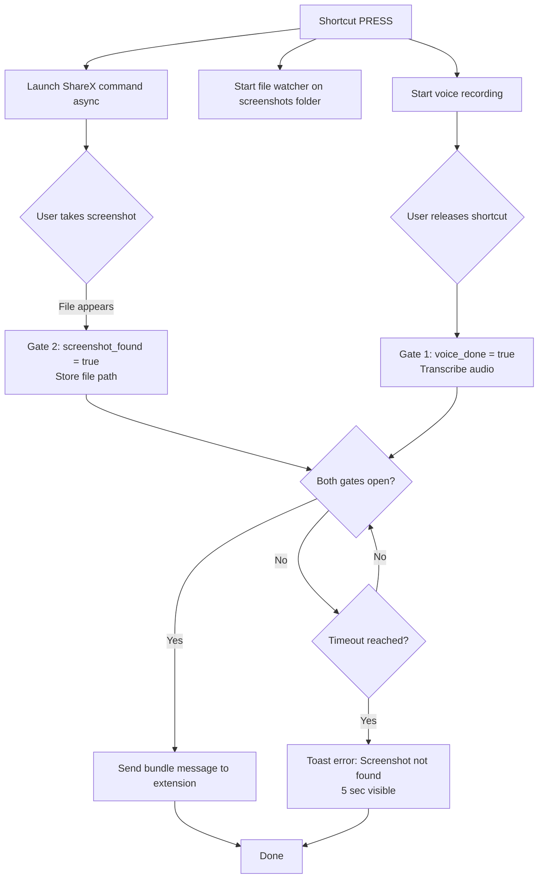

# Send Screenshot to Extension - Implementation Plan

## Feature Overview

Add a new shortcut action "Send Screenshot to Extension" that captures both a voice instruction and a screenshot, then sends them together to the Handy Connector browser extension as a `bundle` message.

## Workflow Diagram



## Settings to Add

### New Fields in AppSettings

| Field | Type | Default | Description |
|-------|------|---------|-------------|
| `screenshot_capture_command` | `String` | `C:\Program Files\ShareX\ShareX.exe -RectangleRegion` | Command to launch screenshot tool |
| `screenshot_folder` | `String` | `%USERPROFILE%\Pictures\Screenshots` | Folder to watch for new screenshots |
| `screenshot_require_recent` | `bool` | `true` | Only accept files created within timeout window |
| `screenshot_timeout_seconds` | `u32` | `5` | How long to wait for screenshot to appear |
| `send_screenshot_to_extension_push_to_talk` | `bool` | `true` | Push-to-talk mode for this action |

## File Changes Required

### Backend (Rust)

#### 1. `src-tauri/src/settings.rs`
- Add new fields to `AppSettings` struct
- Add default value functions
- Expand screenshots folder path at runtime

#### 2. `src-tauri/src/actions.rs`
- Create `SendScreenshotToExtensionAction` struct
- Implement `ShortcutAction` trait with two-gate logic
- Handle parallel voice recording and file watching
- Register in `ACTION_MAP`

#### 3. `src-tauri/src/managers/connector.rs`
- Add `BlobAttachment` struct for tracking served files
- Add `queue_bundle_message` method for sending bundles with attachments
- Add `/blob/{attId}` endpoint handler
- Store pending blobs with expiration

#### 4. `src-tauri/resources/default_settings.json`
- Add default values for new settings

### Frontend (TypeScript/React)

#### 5. `src/components/settings/browser-connector/BrowserConnectorSettings.tsx`
- Add new settings section for Screenshot capture
- Input for capture command
- Input for screenshots folder with folder picker
- Toggle for require recent files
- Number input for timeout seconds

#### 6. `src/hooks/useSettings.ts`
- Add update methods for new settings

#### 7. `src/i18n/locales/en/translation.json`
- Add translations for new UI elements

#### 8. `src/App.tsx`
- Add event listener for `screenshot-error` events

### Documentation

#### 9. `fork-agents.md`
- Document new feature and files

#### 10. `code-notes.md`
- Add new files to the list

## Implementation Details

### Two-Gate State Machine

```rust
struct ScreenshotCaptureState {
    voice_done: bool,
    voice_text: Option<String>,
    screenshot_path: Option<PathBuf>,
    start_time: Instant,
    timeout_seconds: u32,
}
```

### File Watcher Implementation

Use `notify` crate for cross-platform file watching:
- Watch screenshots folder for new files
- Filter by: extension (png, jpg, jpeg), creation time within timeout window
- Stop watching once a valid file is found

### Bundle Message Format

Per messaging-contract.md:

```json
{
  "id": "msg_bundle_01",
  "ts": 1735084000500,
  "type": "bundle",
  "text": "Analyze this image",
  "attachments": [
    {
      "attId": "img_01",
      "kind": "image",
      "filename": "screenshot.png",
      "mime": "image/png",
      "size": 10240,
      "fetch": {
        "url": "http://127.0.0.1:63155/blob/img_01",
        "method": "GET",
        "headers": {},
        "expiresAt": 1735084300000
      }
    }
  ]
}
```

### Error Handling

- Command not found → Toast: "Screenshot tool not found: {path}"
- Folder not found → Toast: "Screenshots folder not found: {path}"
- Timeout → Toast: "No screenshot found within {N} seconds"
- File read error → Toast: "Failed to read screenshot: {error}"

All errors displayed via `toast.error()` with 5 second duration.

## New Dependencies

Add to `Cargo.toml`:
```toml
notify = "6.1"  # File system notifications
```

## Testing Checklist

- [ ] ShareX launches on shortcut press
- [ ] File watcher detects new screenshots
- [ ] Voice recording works in parallel
- [ ] Both gates must be satisfied before send
- [ ] Timeout shows error toast
- [ ] Bundle message has correct format
- [ ] Extension can download blob from /blob endpoint
- [ ] Settings persist across restarts
- [ ] Custom capture command works
- [ ] Custom folder path works
- [ ] Timeout value is respected

## UI Mockup

```
┌─────────────────────────────────────────────────────────────────┐
│ Screenshot Capture                                              │
├─────────────────────────────────────────────────────────────────┤
│                                                                 │
│ Capture Command                                                 │
│ ┌─────────────────────────────────────────────────────────────┐ │
│ │ C:\Program Files\ShareX\ShareX.exe -RectangleRegion       │ │
│ └─────────────────────────────────────────────────────────────┘ │
│ Command to launch screenshot tool. ShareX recommended.          │
│                                                                 │
│ Screenshots Folder                                              │
│ ┌─────────────────────────────────────────────────────────────┐ │
│ │ C:\Users\John\Pictures\Screenshots                    [📁] │ │
│ └─────────────────────────────────────────────────────────────┘ │
│ Folder where screenshots are saved.                             │
│                                                                 │
│ ┌────┐ Only accept recent files                                │
│ │ ✓  │ Only pick up files created within the timeout window.   │
│ └────┘                                                          │
│                                                                 │
│ Timeout                                                         │
│ ┌──────────┐                                                    │
│ │ 5        │ seconds                                            │
│ └──────────┘                                                    │
│ How long to wait for a screenshot after voice ends.             │
│                                                                 │
└─────────────────────────────────────────────────────────────────┘
```

## Sequence Diagram

```mermaid
sequenceDiagram
    participant User
    participant Handy
    participant ShareX
    participant FileSystem
    participant Extension

    User->>Handy: Press shortcut
    Handy->>ShareX: Launch capture command
    Handy->>FileSystem: Start watching folder
    Handy->>Handy: Start voice recording
    
    par Voice Recording
        User->>Handy: Speak instruction
    and Screenshot
        User->>ShareX: Select region
        ShareX->>FileSystem: Save screenshot
        FileSystem-->>Handy: New file event
        Handy->>Handy: Gate 2: screenshot found
    end
    
    User->>Handy: Release shortcut
    Handy->>Handy: Gate 1: voice done
    Handy->>Handy: Transcribe audio
    
    Note over Handy: Both gates open
    
    Handy->>Extension: Queue bundle message
    Extension->>Handy: GET /blob/attId
    Handy-->>Extension: Return image bytes
    Extension->>Extension: Send to AI chat
